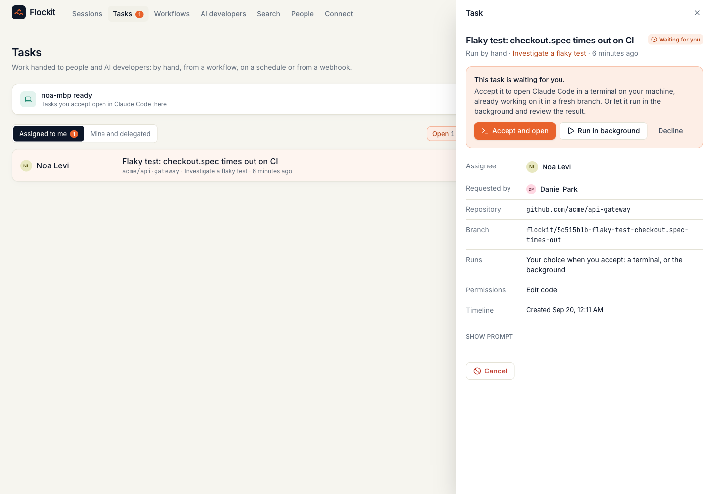
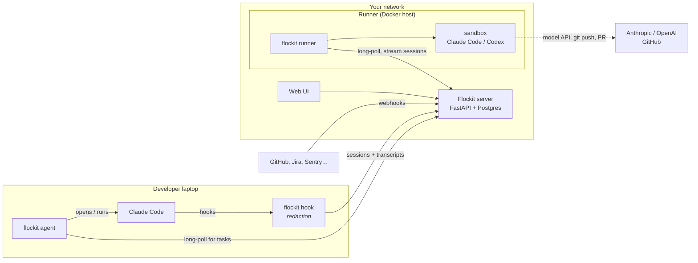

<p align="center">
  
</p>

<h1 align="center">Flockit</h1>

<p align="center">
  <b>The self-hosted control plane for an engineering org of people and AI developers.</b><br>
  See every coding session, human and AI, in one place. Hand work to a teammate's Claude Code or to an AI developer.<br>
  Automate it with workflows. Keep everything your agents learned, searchable, on your own server.
</p>

<p align="center">
  <a href="https://github.com/giladlevy1/flockit/actions/workflows/ci.yml"></a>
  <a href="LICENSE"></a>
  
  
</p>


## What it does

| | |
|---|---|
| **See** | Every Claude Code session across the org, live and historical: who, which agent and model, repo, branch, ticket, duration, tokens, how it ended. Sessions by AI developers sit next to people's, attributed to the person who asked for them. |
| **Delegate** | Turn any piece of work into a **task**. Give it to a teammate: it appears in their inbox, and when they accept, **Claude Code opens on their laptop** in a fresh git worktree, already working on it. Or give it to an **AI developer**, which runs Claude Code or Codex in a Docker sandbox on your runner, pushes a branch and opens a pull request. |
| **Automate** | **Workflows** create tasks by hand, on a **schedule** (cron with time zones), or from a **webhook** any system can call: GitHub, Jira, Linear, Sentry, Zendesk, PagerDuty. |
| **Remember** | The full conversation of every session, redacted on the laptop: prompts, replies, commands, files edited, token usage. **Search** it across the org ("how did we fix the checkout race?"), open any session as a timeline, and **hand off** unfinished work to a person or an AI developer with the context attached. |

<table>
<tr>
<td width="50%"><br><sub><b>Tasks</b>: people and AI developers side by side</sub></td>
<td width="50%"><br><sub><b>A webhook-triggered bug</b>, fixed by an AI developer, PR ready</sub></td>
</tr>
<tr>
<td><br><sub><b>A developer's inbox</b>: accept, and Claude Code opens on their machine</sub></td>
<td><br><sub><b>Every session as a timeline</b>: prompts, tool calls, files</sub></td>
</tr>
<tr>
<td><br><sub><b>Workflows</b>: manual, scheduled, webhook</sub></td>
<td><br><sub><b>AI developers</b> and the runners they work on</sub></td>
</tr>
</table>

## The questions a security review asks first

**Does our code or data leave our network?**
The Flockit server makes **no outbound calls**: no telemetry, no analytics, no update or license check ([verified with a packet
capture](docs/network-trace.md)). Collectors on laptops talk only to your Flockit server. **Runners** are the one deliberate
exception: an AI developer needs a model, so runners call your model provider (Anthropic or OpenAI) and your git host, with
credentials that live only on the runner.

**What is captured, and what is redacted?**
Session metadata plus the full conversation: prompts, agent replies, tool calls and their (truncated) output, files edited, token
usage. Before anything leaves a laptop, the collector **strips credentials** (API keys, tokens, passwords, private keys,
connection strings, secret-named environment variables, high-entropy blobs) and **rewrites paths** so usernames and directory
layouts are never sent. The redaction step has its own [test suite](collector/tests/test_redact.py). Transcripts are visible
only within role scope: developers see their own, leads their teams', admins the organisation's.

**Where do the git and model credentials for AI developers live?**
On the runner, never in a sandbox. The container gets the task, the repository and a task-scoped ingest token; the runner itself
does the clone and the push, and hands its git token only to hosts on an allowlist (`FLOCKIT_ALLOWED_GIT_HOSTS`, GitHub/GitLab/
Bitbucket by default). A task that names some other host is refused when it is created, so no one can point a runner at a server
that collects tokens.

**Can Flockit run code on my laptop?**
Only if you let it. A task sent to you waits in your inbox until you accept it (then Claude Code opens in a terminal, in a new
git worktree, so your own checkout is never touched). You can allow **auto-start** for workflows you trust; auto-started tasks run
headless with a tool allowlist (edit files, git, tests; nothing else). **Webhook-triggered work never auto-starts on a person's
machine**, because webhook text is written by whoever can file a ticket. Pause everything with one click, or `flockit agent stop`.

**Does it work with the agents we already use?**
Claude Code today, on laptops and runners, through its native hooks: no terminal wrapping, no proxy. AI developers can run
Claude Code or **Codex**. The ingest API is vendor-neutral.

**How long does it take to deploy?**
One compose file. `git clone` to the first captured session took **35 seconds** in our test (base images already pulled). Each
developer installs the collector and agent with one command, served by your Flockit server, with no internet access needed.

## Quickstart

```bash
git clone https://github.com/giladlevy1/flockit.git
cd flockit
docker compose up -d
```

Open **http://localhost:8080** and create your organisation. Then:

1. **Connect your machine.** On **Connect**, copy the one-line install command. It installs the collector (Claude Code hooks)
   and the agent (so tasks can start on your machine):
   ```bash
   curl -fsSL http://your-flockit-host:8080/install.sh | sh -s -- flk_your_token
   ```
2. **Invite your team** on **People**, and group them into teams. Leads see their teams; admins see everyone.
3. **Add an AI developer** on **AI developers**, then **add a runner** on any machine with Docker:
   ```bash
   curl -fsSL http://your-flockit-host:8080/install.sh | sh -s -- --runner-only
   ~/.flockit/venv/bin/flockit runner build-image
   ANTHROPIC_API_KEY=... GH_TOKEN=... ~/.flockit/venv/bin/flockit runner --server http://your-flockit-host:8080 --token frn_...
   ```
4. **Create a workflow** (for example: GitHub issues labelled `bug` go to your AI developer) and paste its webhook URL into
   GitHub.

> **Want to look around first?** Load a demo organisation into a fresh deployment:
> `docker compose run --rm flockit flockit-server seed-demo`. Sign in as `maya@acme.dev` (admin), `daniel@acme.dev` (lead)
> or `noa@acme.dev` (developer); the password is `flockit-demo`. It includes AI developers, workflows, tasks in every state,
> and searchable transcripts.

For production (HTTPS, backups, upgrades, runner hosts) see the [deployment guide](deploy/README.md).

## How it works



| Component | What it is |
|---|---|
| **Server** (`server/`) | FastAPI + Postgres, one container. Ingest, role scoping, tasks, workflows (scheduler and webhooks), machine APIs, full-text search, audit log. Serves the UI and the CLI package. |
| **Web UI** (`web/`) | React. Sessions, tasks, workflows, AI developers, search, people, connect. Works on a phone. |
| **CLI** (`collector/`) | One zero-dependency Python package, `flockit`: the Claude Code **hook** (capture and redaction), the **agent** (launchd/systemd user service that starts tasks on a laptop), and the **runner** (Docker sandboxes for AI developers). |

Task lifecycle: `offered → queued → starting → running → succeeded | failed` (plus `declined`, `cancelled`). A person's task is
offered to them; an AI developer's task is queued for a runner. Every task gets its own branch (`flockit/<id>-<title>`), its own
workspace, and a linked session you can open.

### Roles

| Role | Sees | Can |
|---|---|---|
| **Developer** | their own sessions, tasks assigned to or created by them | create tasks for themselves and for AI developers |
| **Lead** | everyone on their teams, including AI developers on those teams | assign work to teammates, manage workflows |
| **Admin** | the whole organisation | manage people, teams, AI developers, runners; audit log |

Every session has a **human owner**. An AI developer's work is owned by the person who assigned it (or its sponsor), and the
AI developer is recorded as the actor, so accountability never disappears into a bot account.

## What Flockit deliberately does not do

- **No hosted SaaS, no telemetry.** Self-hosted is the only mode.
- **No code indexing or embeddings.** Flockit remembers what people and agents did and decided, not a copy of your repositories.
- **No IDE plugin.** It works with the agents your developers already use.

## Roadmap

| | |
|---|---|
| ✅ **0.1** | The R&D view: every session, human and AI, in one place |
| ✅ **0.2** | Tasks, workflows (manual, cron, webhook), laptop agent, AI developers and runners, full transcripts, org-wide search, hand-off, audit log |
| **Next** | Benchmark harness: tokens and time with and without Flockit context, reproducible on your own repo |
| | Verified memory served over MCP: facts re-derived by the command that produced them, withheld when stale |
| | Decision capture: a review rejection becomes a rule the next agent follows |
| | SSO/SCIM, outbound notifications (Slack) as an opt-in integration |

## Development

```bash
make dev-db          # Postgres on :55432
make dev-server      # API on :8080 with reload
make dev-web         # UI on :5173 with hot reload
make test            # CLI (Python 3.9+), server and web suites
```

See [CONTRIBUTING.md](CONTRIBUTING.md), [docs/architecture.md](docs/architecture.md) and [docs/decisions.md](docs/decisions.md).

## Security

Found a vulnerability? Please report it privately; see [SECURITY.md](SECURITY.md).

## License

[Apache 2.0](LICENSE).
