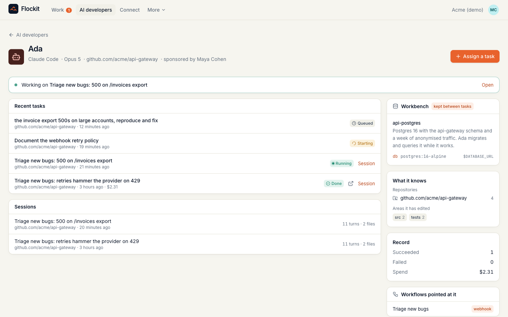
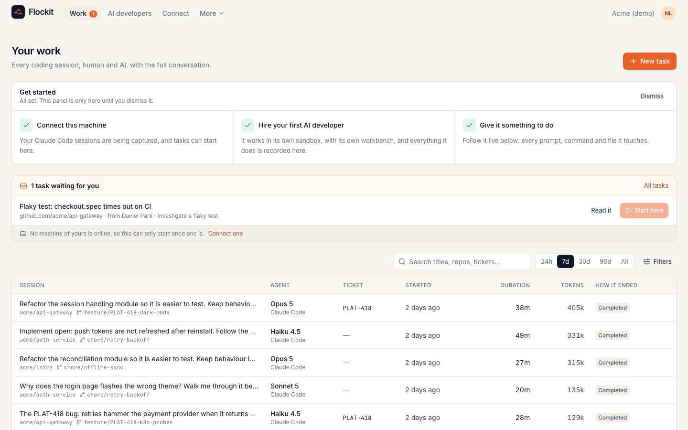
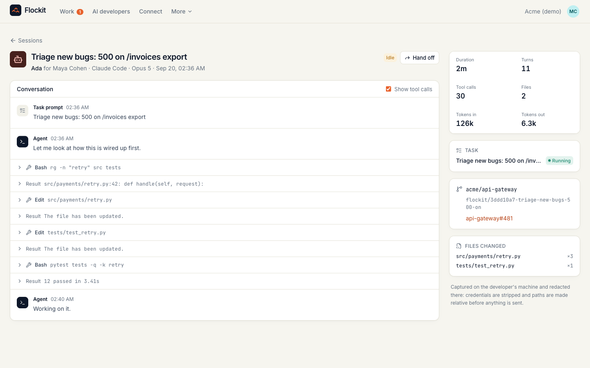
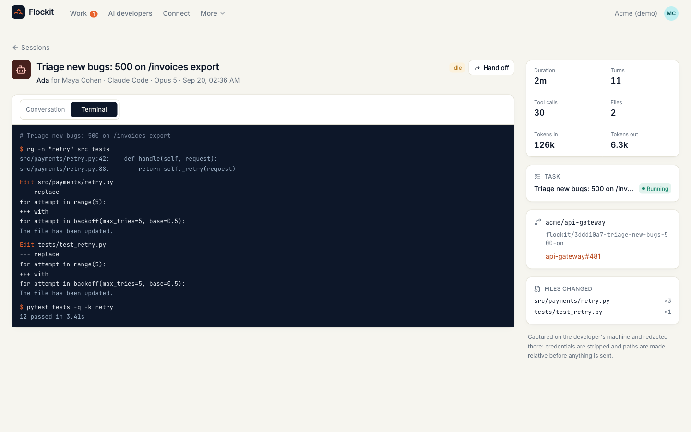
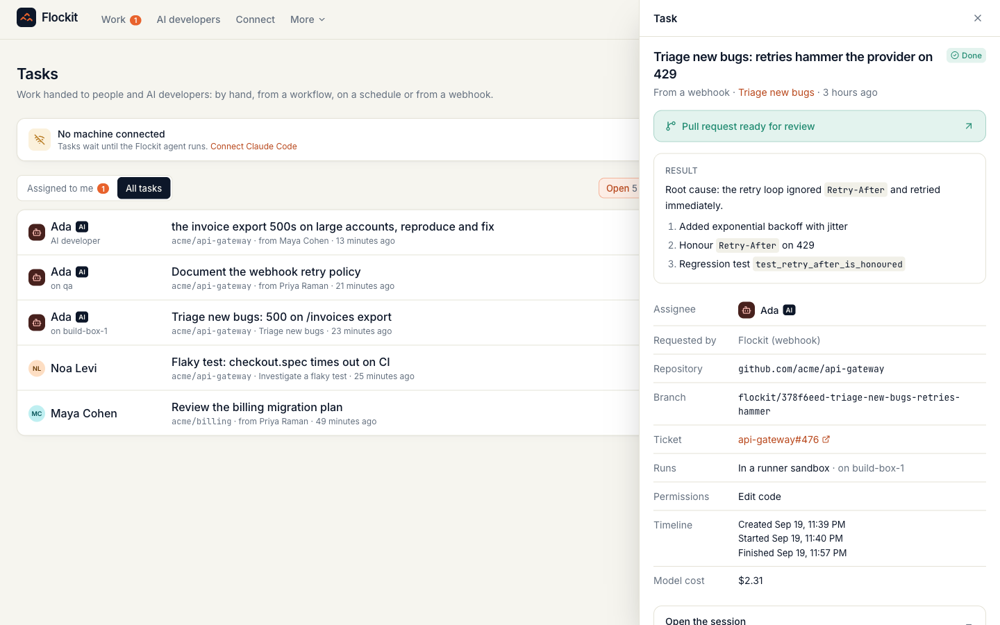
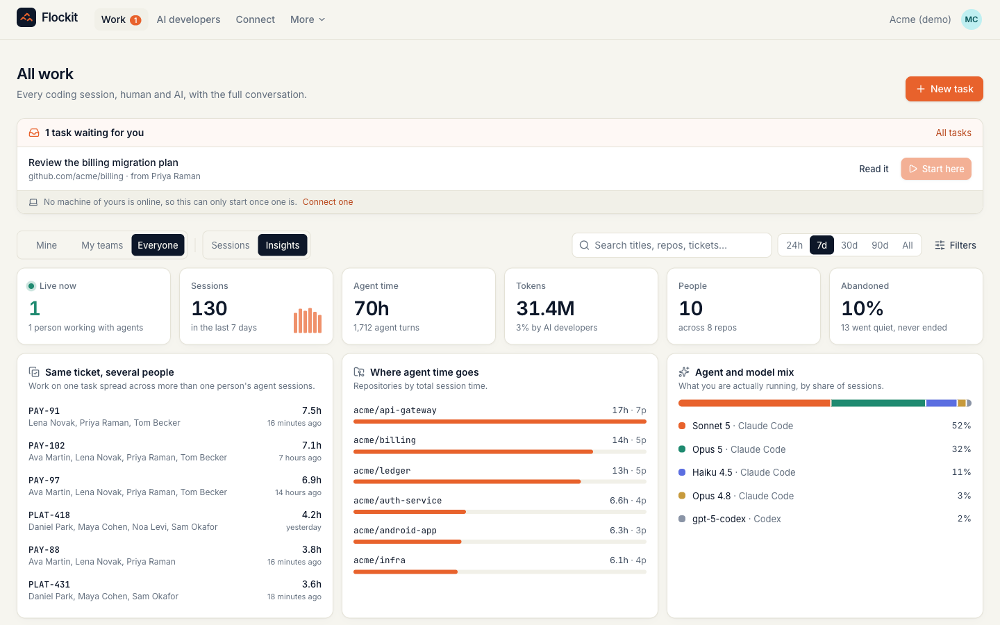
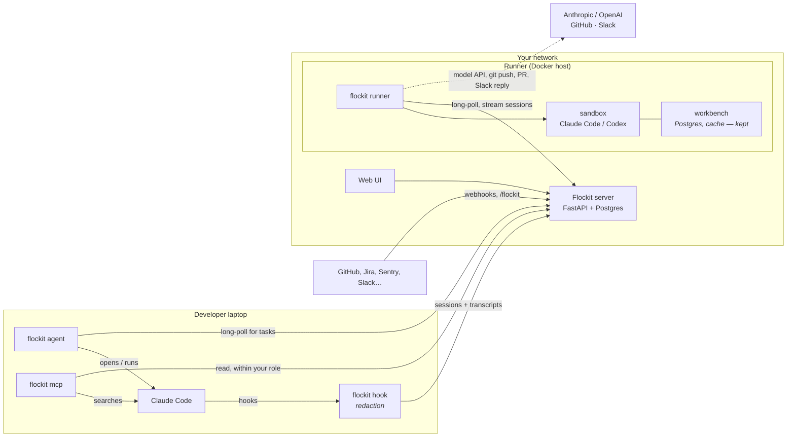

<p align="center">
  
</p>

<h1 align="center">Flockit</h1>

<p align="center">
  <b>The self-hosted control plane for an AI-native SDLC.</b><br>
  Your team already writes code with agents. Flockit is the layer underneath it:<br>
  every session captured, work dispatched to people or AI developers, agents that test against real environments —<br>
  and sessions that keep going when a laptop closes.
</p>

<p align="center">
  <a href="https://github.com/giladlevy1/flockit/actions/workflows/ci.yml"></a>
  <a href="LICENSE"></a>
  
  
</p>


## The problem this solves

Agents now write a large share of your code, and your SDLC has no idea. Sessions happen on
laptops and disappear when they end. Nobody can search what was tried last month. Work
cannot be handed between a person and an agent. Agents write code they have never run,
so a human becomes the test suite. And when a laptop closes mid-task, the work is simply
gone.

Flockit is the infrastructure under that: **the same lifecycle your team already has —
intake, build, test, review — with agents as first-class participants in it.**

| Stage of the SDLC | What Flockit adds |
|---|---|
| **Intake** | Work arrives from a ticket, a schedule, a webhook or Slack and becomes a **task** for a person or an AI developer — with the same rules, the same audit trail, either way. |
| **Build** | Every Claude Code session, on a laptop or in a sandbox, is captured live: prompts, commands, files, cost. If the machine goes away mid-task, **the session continues** on that person's own AI developer. |
| **Test** | Each AI developer gets a **workbench**: your schema, your data shape, a customer's account. It runs the app and the tests against something real before a human reads a line. |
| **Review** | The change arrives as a pull request with the whole session behind it — what was tried, what failed, what it cost. |
| **Memory** | All of it stays searchable, and is available **inside the next session** over MCP, so the org stops solving the same problem twice. |

## Start here

| | |
|---|---|
| **One developer** | Your own sessions become searchable, your editor can query them, and an AI developer works on your machine. Twenty minutes. → **[docs/solo.md](docs/solo.md)** |
| **A team** | Server, roles, runners, workbenches, workflows, Slack. About an hour for the first team. → **[docs/team.md](docs/team.md)** |

```bash
git clone https://github.com/giladlevy1/flockit.git && cd flockit && docker compose up -d
```

Open <http://localhost:8080>. Or look around a fully populated demo first:
`docker compose run --rm flockit flockit-server seed-demo` (sign in as `maya@acme.dev` / `flockit-demo`).

## What it does

| | |
|---|---|
| **Never stop** | Close your laptop mid-task and the work carries on: the agent snapshots your working tree as you go, and when your machine drops off, **your own AI developer picks the session up** — same repository, same uncommitted changes, same conversation. [→](docs/always-on.md) |
| **See** | Every Claude Code session across the org, live and historical: who, which agent and model, repo, branch, ticket, duration, tokens, how it ended. Sessions by AI developers sit next to people's, attributed to the person who asked for them. |
| **Delegate** | Turn any piece of work into a **task**. Give it to a teammate: it appears in their inbox, and when they accept, **Claude Code opens on their laptop** in a fresh git worktree, already working on it. Or give it to an **AI developer**, which runs Claude Code or Codex in a Docker sandbox on your runner, pushes a branch and opens a pull request. |
| **Automate** | **Workflows** create tasks by hand, on a **schedule** (cron with time zones), or from a **webhook** any system can call: GitHub, Jira, Linear, Sentry, Zendesk, PagerDuty. |
| **Remember** | The full conversation of every session, redacted on the laptop: prompts, replies, commands, files edited, token usage. **Search** it across the org ("how did we fix the checkout race?"), open any session as a timeline, and **hand off** unfinished work to a person or an AI developer with the context attached. |
| **Trust** | Each AI developer gets a **workbench**: a Postgres with your schema, a cache, a stand-in for one customer's account — kept between tasks like a person's own machine. It migrates, seeds, queries and **runs your tests** before it opens a pull request, so you review a change that has been run. [→](docs/workbenches.md) |
| **Reuse** | That archive is available **inside Claude Code** over MCP. Ask "has anyone hit this before?" and get your organisation's actual answer, then hand the work to an AI developer without leaving the session. [→](docs/mcp.md) |
| **Start anywhere** | `/flockit ada the checkout webhook retries forever on 429` from the channel where the complaint arrived; the pull request comes back in the same thread. [→](docs/slack.md) |

<table>
<tr>
<td width="50%"><br><sub><b>An AI developer</b>: its workbench, the areas it knows, its record</sub></td>
<td width="50%"><br><sub><b>A developer's home</b>: what needs a decision, then their work</sub></td>
</tr>
<tr>
<td><br><sub><b>Every session as a timeline</b> — and <b>Continue</b> to pick it up again</sub></td>
<td><br><sub><b>Or read it as a terminal</b>: what ran, and what came back</sub></td>
</tr>
<tr>
<td><br><sub><b>A webhook-triggered bug</b>, fixed by an AI developer, PR ready</sub></td>
<td><br><sub><b>Insights</b> for leads: people and AI in one record</sub></td>
</tr>
</table>

## The questions a security review asks first

**Does our code or data leave our network?**
The Flockit server makes **no outbound calls**: no telemetry, no analytics, no update or license check ([verified with a packet
capture](docs/network-trace.md)). Collectors on laptops talk only to your Flockit server. **Runners** are the one deliberate
exception: an AI developer needs a model, so runners call your model provider (Anthropic or OpenAI) and your git host, with
credentials that live only on the runner.

**What is captured, and what is redacted?**
Session metadata plus the full conversation: prompts, agent replies, tool calls and their (truncated) output, files edited, token
usage. Before anything leaves a laptop, the collector **strips credentials** (API keys, tokens, passwords, private keys,
connection strings, secret-named environment variables, high-entropy blobs) and **rewrites paths** so usernames and directory
layouts are never sent. The redaction step has its own [test suite](collector/tests/test_redact.py). Transcripts are visible
only within role scope: developers see their own, leads their teams', admins the organisation's.

**Where do the git and model credentials for AI developers live?**
On the runner, never in a sandbox. The container gets the task, the repository and a task-scoped ingest token; the runner itself
does the clone and the push, and hands its git token only to hosts on an allowlist (`FLOCKIT_ALLOWED_GIT_HOSTS`, GitHub/GitLab/
Bitbucket by default). A task that names some other host is refused when it is created, so no one can point a runner at a server
that collects tokens.

**If my editor can search everyone's sessions, who can read what?**
Exactly what the web UI would show that person: developers their own, leads their teams', admins the organisation — enforced by
the API, not by the client. Editor access is a **separate, opt-in token** each person creates for themselves: a collector token
(which sits in a config file on every laptop) cannot read anything, and an editor token cannot write sessions. Revoke either on
the Connect page. ([docs/mcp.md](docs/mcp.md))

**Does Slack mean the server talks to the internet?**
No. Slack POSTs in, and the slash command is answered in the reply to that same request. The result is posted back by the
**runner** that did the work, with its own bot token. Requests are rejected unless Slack's signature checks out and the
timestamp is fresh, and Slack-triggered work never auto-starts on a person's machine. ([docs/slack.md](docs/slack.md))

**Can Flockit run code on my laptop?**
Only if you let it. A task sent to you waits in your inbox until you accept it (then Claude Code opens in a terminal, in a new
git worktree, so your own checkout is never touched). You can allow **auto-start** for workflows you trust; auto-started tasks run
headless with a tool allowlist (edit files, git, tests; nothing else). **Webhook-triggered work never auto-starts on a person's
machine**, because webhook text is written by whoever can file a ticket. Pause everything with one click, or `flockit agent stop`.

**Does it work with the agents we already use?**
Claude Code today, on laptops and runners, through its native hooks: no terminal wrapping, no proxy. AI developers can run
Claude Code or **Codex**. The ingest API is vendor-neutral.

**How long does it take to deploy?**
One compose file. `git clone` to the first captured session took **35 seconds** in our test (base images already pulled). Each
developer installs the collector and agent with one command, served by your Flockit server, with no internet access needed.

## Setting it up

Start the server (`docker compose up -d`), open it, create your organisation. Then, in the order that pays off fastest:

1. **Connect your machine.** **Connect** shows a one-line command. It installs the collector (Claude Code hooks) and the
   agent, so your sessions are captured and work can be sent to you:
   ```bash
   curl -fsSL http://your-flockit-host:8080/install.sh | sh -s -- flk_your_token
   ```
2. **Give your editor the memory.** Create an **editor token** on the same page:
   ```bash
   ~/.flockit/venv/bin/flockit mcp install --token flk_your_editor_token
   ```
   Now Claude Code can search every session you are allowed to see. ([docs/mcp.md](docs/mcp.md))
3. **Start a runner** on any machine with Docker — the one component with outbound access:
   ```bash
   curl -fsSL http://your-flockit-host:8080/install.sh | sh -s -- --runner-only
   ~/.flockit/venv/bin/flockit runner build-image
   ANTHROPIC_API_KEY=... GH_TOKEN=... ~/.flockit/venv/bin/flockit runner --server http://your-flockit-host:8080 --token frn_...
   ```
4. **Hire an AI developer** and give it a **workbench** (a Postgres with your schema is one click). Assign it a real
   ticket and watch it work. ([docs/workbenches.md](docs/workbenches.md))
5. **Automate it**: a workflow on a schedule, a webhook from GitHub or Zendesk, or `/flockit` from Slack
   ([docs/slack.md](docs/slack.md)).

Full walkthroughs: **[one developer](docs/solo.md)** · **[a team](docs/team.md)** · [production deployment](deploy/README.md).

## How it works



| Component | What it is |
|---|---|
| **Server** (`server/`) | FastAPI + Postgres, one container. Ingest, role scoping, tasks, workflows (scheduler and webhooks), machine APIs, full-text search, audit log. Serves the UI and the CLI package. |
| **Web UI** (`web/`) | React. Sessions, tasks, workflows, AI developers, search, people, connect. Works on a phone. |
| **CLI** (`collector/`) | One zero-dependency Python package, `flockit`: the Claude Code **hook** (capture and redaction), the **agent** (launchd/systemd user service that starts tasks on a laptop), the **runner** (Docker sandboxes and workbenches for AI developers), and **`flockit mcp`** (the org's history inside your editor). |

Task lifecycle: `offered → queued → starting → running → succeeded | failed` (plus `declined`, `cancelled`). A person's task is
offered to them; an AI developer's task is queued for a runner. Every task gets its own branch (`flockit/<id>-<title>`), its own
workspace, and a linked session you can open.

### Roles

| Role | Sees | Can |
|---|---|---|
| **Developer** | their own sessions, tasks assigned to or created by them | create tasks for themselves and for AI developers |
| **Lead** | everyone on their teams, including AI developers on those teams | assign work to teammates, manage workflows |
| **Admin** | the whole organisation | manage people, teams, AI developers, runners; audit log |

Every session has a **human owner**. An AI developer's work is owned by the person who assigned it (or its sponsor), and the
AI developer is recorded as the actor, so accountability never disappears into a bot account.

## What Flockit deliberately does not do

- **No hosted SaaS, no telemetry.** Self-hosted is the only mode.
- **No code indexing or embeddings.** Flockit remembers what people and agents did and decided, not a copy of your repositories.
- **No IDE plugin.** It works with the agents your developers already use — over MCP, which they already speak.
- **No outbound calls from the server.** Integrations are inbound (webhooks, Slack commands); anything that has to reach
  out, like posting a Slack reply, is done by a runner, which already has network access and holds the credentials.

## Roadmap

| | |
|---|---|
| ✅ **0.1** | The R&D view: every session, human and AI, in one place |
| ✅ **0.2** | Tasks, workflows (manual, cron, webhook), laptop agent, AI developers and runners, full transcripts, org-wide search, hand-off, audit log |
| ✅ **0.3** | Workbenches (a persistent database per AI developer), the archive in your editor over MCP, Slack commands, continue-a-session, a home page that is your work rather than a dashboard |
| ✅ **0.4** | **Always-on sessions**: a closed laptop hands the work to your own AI developer, from your working tree as you left it |
| **Next** | Benchmark harness: tokens and time with and without Flockit context, reproducible on your own repo |
| | Verified memory: facts re-derived by the command that produced them, withheld when stale, served through the same MCP tools |
| | Decision capture: a review rejection becomes a rule the next agent follows |
| | Review and test stages an AI developer runs before it asks for a human; SSO/SCIM |

## Development

```bash
make dev-db          # Postgres on :55432
make dev-server      # API on :8080 with reload
make dev-web         # UI on :5173 with hot reload
make test            # CLI (Python 3.9+), server and web suites
```

See [CONTRIBUTING.md](CONTRIBUTING.md), [docs/architecture.md](docs/architecture.md) and [docs/decisions.md](docs/decisions.md).

## Security

Found a vulnerability? Please report it privately; see [SECURITY.md](SECURITY.md).

## License

[Apache 2.0](LICENSE).
