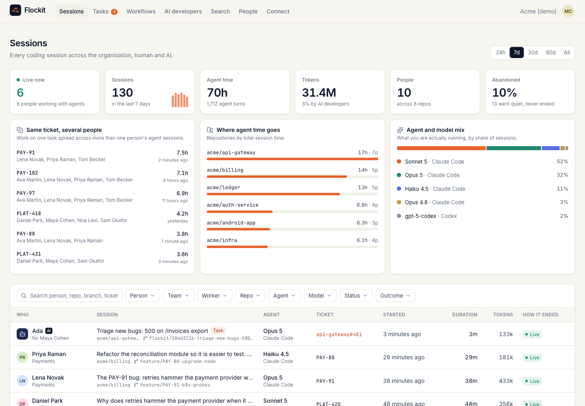
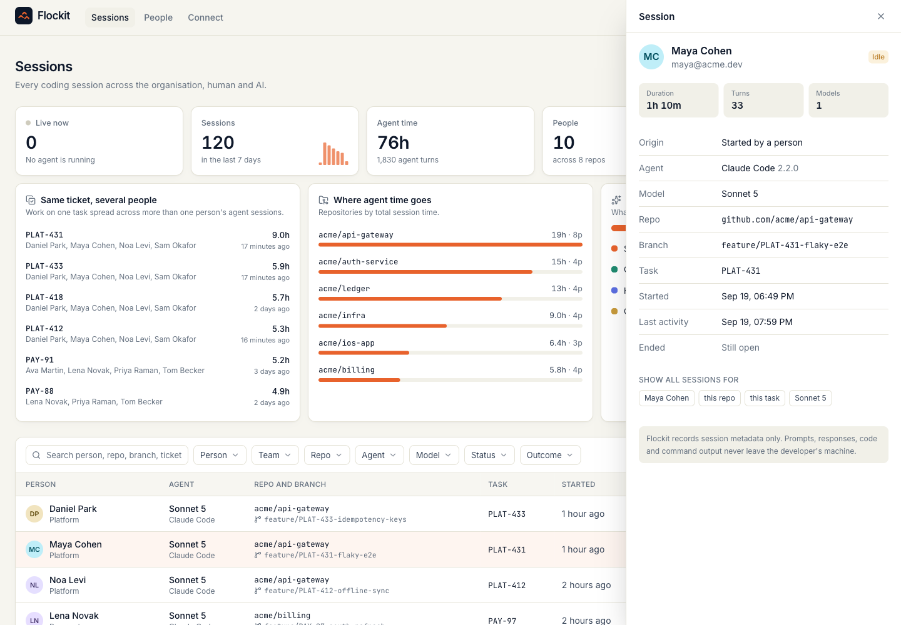
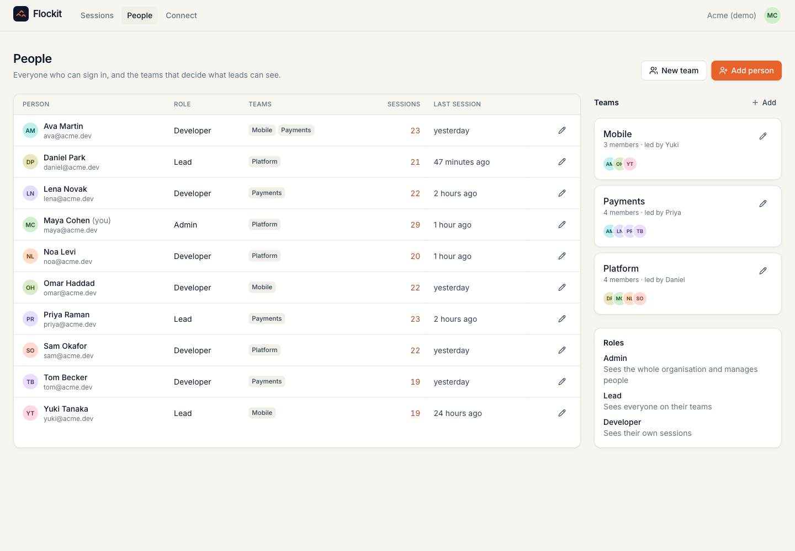
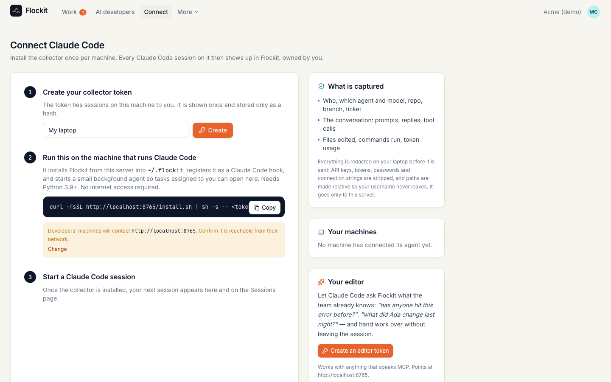
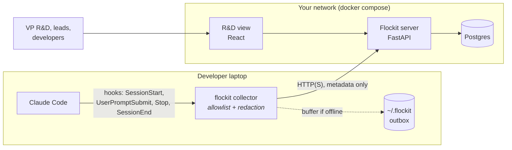

<p align="center">
  
</p>

<h1 align="center">Flockit</h1>

<p align="center">
  <b>Every coding session, human and AI, in one place.</b><br>
  A self-hosted control plane for R&amp;D. See which people and which agents are working on what,<br>
  on which repo, with which model, for how long, and how it ended.
</p>

<p align="center">
  <a href="https://github.com/giladlevy1/flockit/actions/workflows/ci.yml"></a>
  <a href="LICENSE"></a>
  
  
</p>



## The five questions, answered first

**1. Does any code or prompt leave my network?**
No. Flockit runs entirely inside your network (`docker compose up`). The collector on each laptop sends
session **metadata only** to your own server, and **redacts secrets on the laptop** before anything is
transmitted. Prompts, responses, code, command output and file paths are never sent: they are not on the
[allowlist](collector/src/flockit/redact.py). The server makes **no outbound calls**: no telemetry, no
analytics, no update check, no license check. We [verified this with a packet capture](docs/network-trace.md).

**2. What do I actually see after installing?**
The screen above. Every Claude Code session across the organisation, live and historical, with the human
owner, the agent and model, the repo and branch, the ticket, how long it ran and how it ended. Filter by
person, team, repo, agent, model, status and date. It also surfaces what no one can see today: **the same
ticket being worked by several people**, where agent time goes by repo, and the model mix you actually run.

**3. What happens when a memory is wrong?**
This release (M0) stores no memories: it is the visibility layer. The memory layer comes next (M2), and it
follows one rule: every fact stores the command that produced it and is re-verified on a schedule; a fact
that cannot re-verify is never served. See the [roadmap](#roadmap).

**4. Does it work with the agent I already use?**
Claude Code today, through its native hooks: no terminal wrapping, no proxy. The ingest API is
vendor-neutral (`agent_vendor` is a free field), so Codex, Cursor and Gemini CLI collectors are next.
Context serving (M2) will speak MCP, which all of them support.

**5. How long does it take to deploy?**
One compose file. In our timed test, `git clone` to the first captured Claude Code session took
**35 seconds** (image built from source with no layer cache; base images already pulled, which adds a
download of roughly 750 MB on a fresh machine). The collector installs from your Flockit server in about
**4 seconds**, with one command and no internet access.

## Quickstart

```bash
git clone https://github.com/giladlevy1/flockit.git
cd flockit
docker compose up -d
```

Open **http://localhost:8080**, create your organisation, then go to **Connect**. It gives each person a
one-line install command with their own token:

```bash
curl -fsSL http://your-flockit-host:8080/install.sh | sh -s -- flk_your_token
```

Start `claude` in any repo. The session appears in the R&D view within seconds.

> **Want to look around first?** Load a demo organisation (10 people, 3 teams, ~220 sessions) into a fresh
> deployment: `docker compose run --rm flockit flockit-server seed-demo`, then sign in as `maya@acme.dev`
> (admin), `daniel@acme.dev` (lead) or `noa@acme.dev` (developer). Password: `flockit-demo`.

For a team deployment, set `FLOCKIT_PUBLIC_URL` in `.env` to the address developers' machines use to reach
the server (see [.env.example](.env.example)), put it behind your usual HTTPS reverse proxy and set
`FLOCKIT_SECURE_COOKIES=true`. The [production guide](deploy/README.md) covers HTTPS, backups and upgrades.

| Session detail | People and teams | Connect a machine |
|---|---|---|
|  |  |  |

Dark mode follows your system: [screenshot](docs/images/rnd-view-dark.png).

## How it works



| Component | What it does |
|---|---|
| **Collector** (`collector/`) | Zero-dependency Python package, registered as a Claude Code hook. Builds each event from an explicit field allowlist, scrubs every string for credentials, buffers locally when the server is unreachable, and never blocks or slows a session (delivery runs in a detached process). |
| **Server** (`server/`) | FastAPI + Postgres. Idempotent, out-of-order-safe ingest; role-scoped queries; local accounts; collector tokens; serves the UI and the collector package itself. |
| **R&D view** (`web/`) | React + TypeScript. One screen: KPIs, insights, filterable session table, session detail. Every filter lives in the URL, so any view is a link you can share. |

### What the collector sends

| Field | Example | Notes |
|---|---|---|
| Session id | `3bff8577-15b4-…` | Claude Code's own id |
| Agent, version, model | `claude-code`, `2.1.220`, `claude-opus-5` | model read from the transcript's metadata, never its content |
| Repo | `github.com/acme/api` | credentials stripped; a repo with no remote reports only its folder name, never the path |
| Branch | `feature/ENG-123-login` | scrubbed for secrets |
| Task | `ENG-123`, `#42`, or an issue URL | from `FLOCKIT_TASK_REF`, the branch name, or the first prompt that mentions one. URLs keep only the ticket part of the path. The prompt itself is never sent. |
| Start source, end reason | `startup`, `prompt_input_exit` | |

Everything else Claude Code passes to hooks (prompts, `last_assistant_message`, transcript paths, working
directory) is discarded on the laptop. The redaction step has its own
[test suite](collector/tests/test_redact.py) covering API keys, tokens, connection strings and environment
variables. It runs before transmission, never on the server.

### Roles

| Role | Sees |
|---|---|
| **Developer** | their own sessions |
| **Lead** | everyone on the teams they belong to |
| **Admin** | the whole organisation; manages people and teams |

Every session has a **required human owner**: the person whose collector token reported it. There are no
anonymous sessions, which is what makes attribution, access reviews and offboarding work.

## What Flockit deliberately does not do

The AI coding market is full of well-funded orchestrators, context engines and review bots. Flockit stays
out of their way on purpose:

- **No agent orchestration or execution.** We observe and (later) serve. We never run the agent.
- **No code indexing or embeddings.** We index sessions and decisions, never repositories.
- **No IDE plugin, no PR review bot.**
- **No hosted SaaS, no telemetry.** Self-hosted is the only mode.

## Roadmap

| Milestone | Status | What it proves |
|---|---|---|
| **M0: the R&D view** | ✅ this release | A leader sees every session, human and AI, in one place |
| **M1: benchmark harness** | next | A reproducible baseline anyone can run on their own repo |
| **M2: verified memory + MCP** | planned | Environment facts served to any agent, measured against M1 |
| **M3: verifier** | planned | Facts re-derived on a schedule; stale facts withheld |
| **M4: cross-vendor** | planned | Capture with Claude Code, consume with Codex |
| **M5: decision capture** | planned | A review rejection becomes a decision the next agent follows |

The schema already carries the seams for these: `session.origin` (`human` or `workflow`), `session.task_ref`,
and empty `fact`, `decision`, `retrieval` and `workflow_run` tables. Retrieval is not coupled to a collector
session, so an agent Flockit did not start can ask for context later.

## Development

```bash
make dev-db          # Postgres on :55432
make dev-server      # API on :8080 with reload
make dev-web         # UI on :5173 with hot reload, proxies the API
make test            # collector, server and web suites
```

Requirements: Docker, Python 3.12 with [uv](https://docs.astral.sh/uv/), Node 22. See
[CONTRIBUTING.md](CONTRIBUTING.md) and [docs/architecture.md](docs/architecture.md).

## Security

Found a vulnerability? Please report it privately; see [SECURITY.md](SECURITY.md).

## License

[Apache 2.0](LICENSE).
