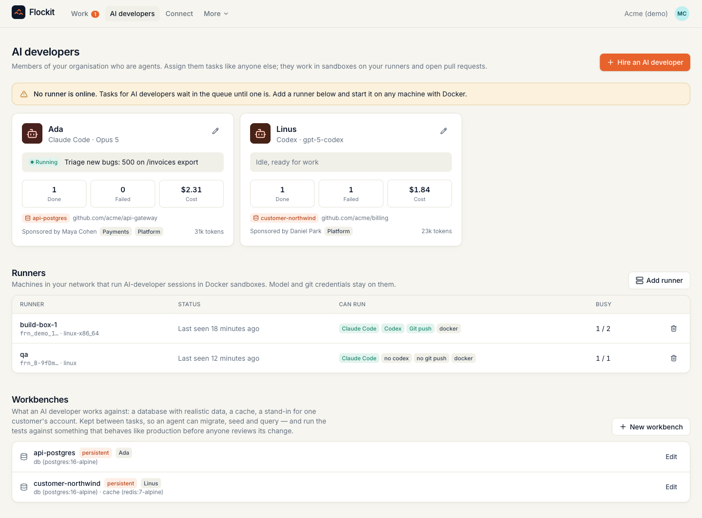
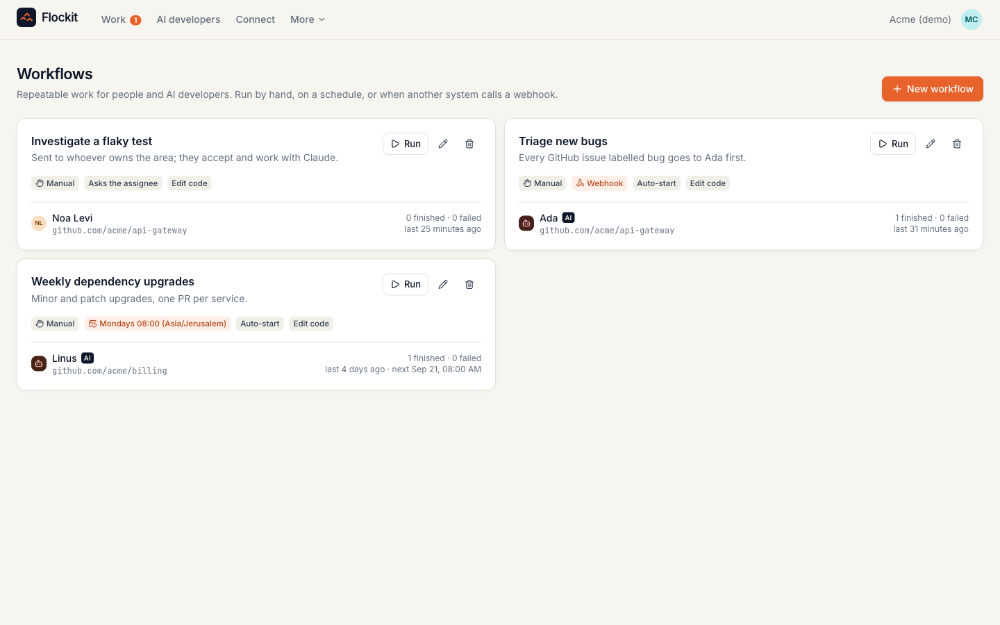
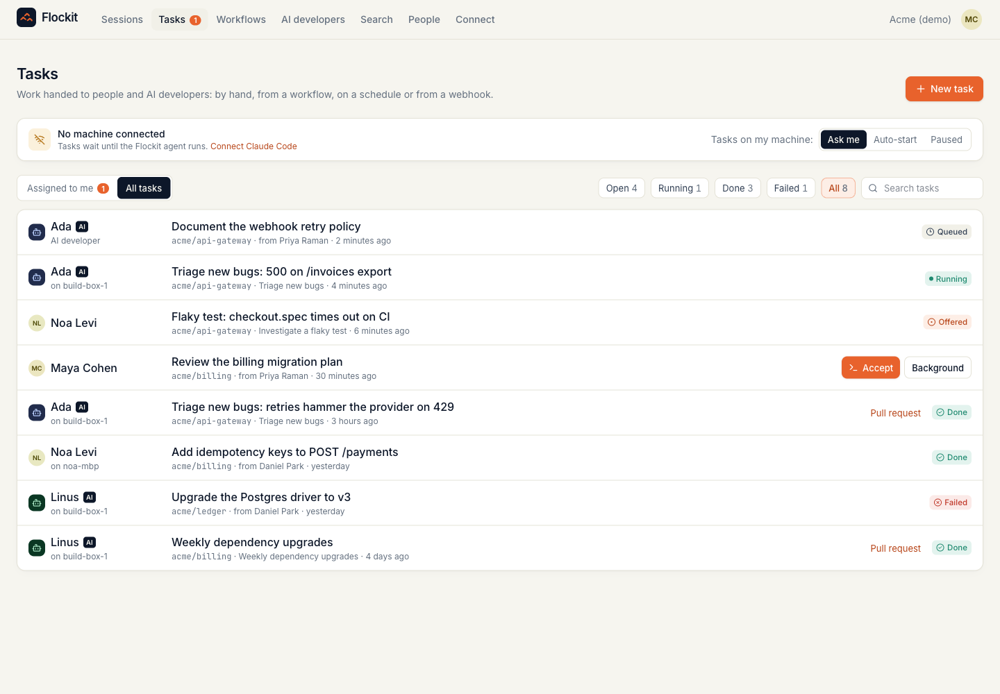
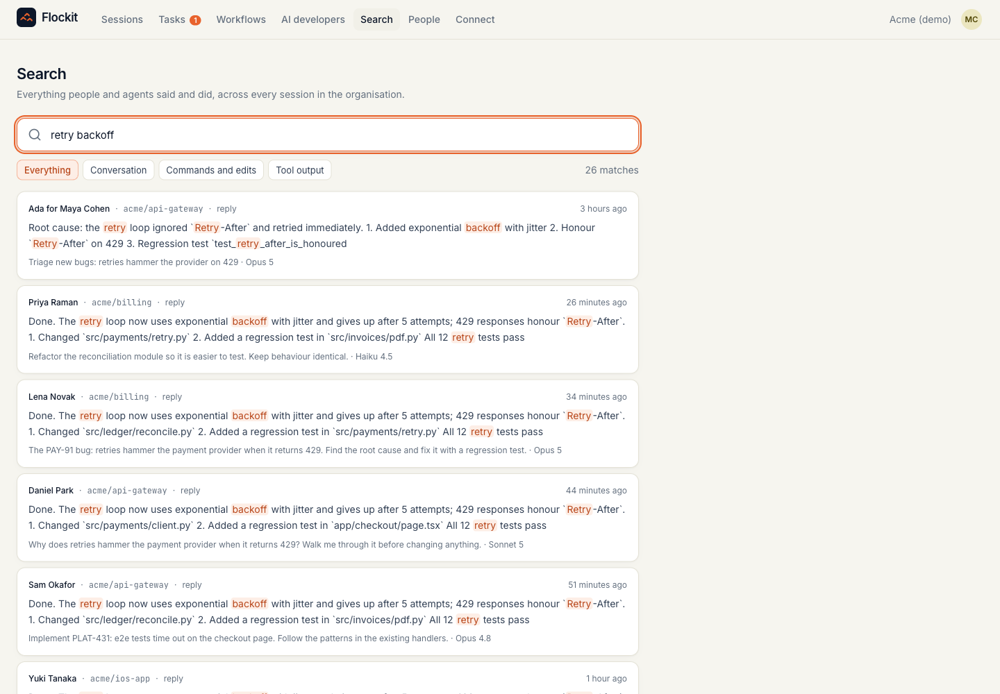

# Flockit for a team

The pitch for a team is not "see what everyone is doing". It is this: **your organisation's coding work is currently
written to nobody's disk.** Every Claude Code session ends and takes with it what was tried, what failed, and why the
fix looks the way it does. Flockit keeps it, makes it searchable by everyone who is allowed to see it, and then uses it
— people search it from their editors, and AI developers take work against the same record.

This page is the rollout: about an hour for the first team, most of it waiting for Docker.

## 1. Deploy the server

One host inside your network, Docker installed. See [deploy/README.md](../deploy/README.md) for HTTPS, backups and
upgrades; the short version:

```bash
git clone https://github.com/giladlevy1/flockit.git && cd flockit
cp .env.example .env     # set POSTGRES_PASSWORD and FLOCKIT_PUBLIC_URL
docker compose up -d
```

`FLOCKIT_PUBLIC_URL` is the address your developers' machines will use. It is baked into the install command, so set
it before anyone installs anything.

The server makes **no outbound calls** — no telemetry, no licence check, no update ping ([verified with a packet
capture](network-trace.md)). It never needs internet access.

## 2. People and teams

**People → Invite.** Three roles, and they decide who can see which sessions:

| Role | Sees | Typically |
|---|---|---|
| `developer` | their own sessions and the AI developers they are given | everyone |
| `lead` | everyone on the teams they belong to, people and AI developers alike | EMs, tech leads |
| `admin` | the whole organisation, plus the audit log | one or two people |

Put people into teams that match how work is actually divided. A lead's view is exactly their teams — there is no
"see everything" setting short of admin, which is the point.

## 3. Everyone connects their machine

Each person opens **Connect** and runs their own one-line command. It takes about four seconds and needs no internet
access: the installer is served by your own Flockit.

```bash
curl -fsSL https://flockit.internal.example.com/install.sh | sh -s -- flk_their_token
```

Tell them what it does and does not do, because you will be asked:

- It captures sessions **after redaction on their machine** — credentials stripped, paths rewritten, usernames never
  sent. The list of what leaves is a short allowlist in the code, with its own test suite.
- It lets work be **offered** to them. Nothing starts on anyone's laptop without them accepting, unless they
  themselves turn on auto-start. Webhook- and Slack-triggered work never auto-starts on a person's machine, ever.
- `flockit agent stop` pauses it; `flockit uninstall` removes it.

## 4. A runner, then AI developers

A runner is any machine with Docker — a build box is ideal. It is the only component with outbound access: it reaches
your model provider and your git host, and holds those credentials.

```bash
curl -fsSL https://flockit.internal.example.com/install.sh | sh -s -- --runner-only
~/.flockit/venv/bin/flockit runner build-image
export ANTHROPIC_API_KEY=...   # or CLAUDE_CODE_OAUTH_TOKEN; OPENAI_API_KEY for Codex
export GH_TOKEN=...            # clone, push, open pull requests
export SLACK_BOT_TOKEN=...     # optional: post results back to Slack
~/.flockit/venv/bin/flockit runner --server https://flockit.internal.example.com --token frn_... --capacity 2
```



Then **hire AI developers**. Treat them like people: give each one a sponsor who answers for its work, put it on a
team, point it at a repository, and give it a **workbench**. One per area beats one per organisation — an agent that
always works in the payments repo, against payments-shaped data, gets better at payments.

## 5. Workbenches: why the output is reviewable

This is the difference between an agent that produces plausible diffs and one whose work you can actually ship.

A workbench is a small set of services — a Postgres with your schema and realistic data, a Redis, a stand-in for one
customer's account — kept running between tasks on the runner, exactly like the database on a developer's laptop. The
AI developer can migrate it, seed it, query it, and **run your test suite against it** before it opens a pull request.

The pattern worth copying: **one workbench per important customer**. Give the AI developer that owns that account its
tickets. It reproduces the bug against data shaped like theirs — their plan, their volumes, their edge cases — instead
of a clean fixture that never fails. See [docs/workbenches.md](workbenches.md).



## 6. Workflows

**Workflows** create tasks without anyone typing them:

- **Manual** — a button, for work you repeat.
- **Schedule** — cron with time zones. "Every Monday at 08:00 Asia/Jerusalem, upgrade minor dependencies."
- **Webhook** — a URL any system can POST to: GitHub, Jira, Linear, Sentry, Zendesk, PagerDuty. With a JSON filter, so
  only issues labelled `bug` reach your AI developer.

A workflow can be aimed at a person (it lands in their inbox, and Claude Code opens on their machine when they accept)
or at an AI developer (it runs in a sandbox). Set that per workflow.



## 7. Slack

Optional, and worth it: `/flockit ada the checkout webhook retries forever on 429` starts the work from the channel
where the complaint arrived, and the result is posted back in the same thread. Setup is one Slack app and two
settings — [docs/slack.md](slack.md).

## 8. Everyone's editor

Have each person create an **editor token** on Connect and run `flockit mcp install --token …`. That is the step that
turns the archive into leverage: their Claude Code can search the org's sessions, within their own role scope, and
hand work to an AI developer without leaving the terminal. [docs/mcp.md](mcp.md)

## What a lead actually does with this

- **Work → Insights** answers "where did the week go" from the same sessions everyone else sees: live work, agent
  hours per repo, model mix, and where two people are working on the same ticket without knowing it.
- **AI developers → one of them** shows what that agent knows: the repositories it has worked in, the parts of the
  codebase it has edited, its record, and what it costs. That is how you decide which one gets the next job.
- **Search** covers every transcript in scope. "How did we fix the checkout race?" returns the session, not a guess.
- **Audit** (admins) records every task, every dispatch, every permission change.



## Rolling it out without a fight

1. Start with one team that already uses Claude Code heavily. Capture only, for a week. No tasks, no AI developers.
2. Show that team their own Insights tab and let them search each other's sessions. This is where the "oh" happens.
3. Add one AI developer with one workbench, pointed at one repository, sponsored by the lead. Give it small, real work.
4. Add a webhook workflow only once the AI developer's pull requests are routinely mergeable.

The order matters: capture earns trust, dispatch spends it.
